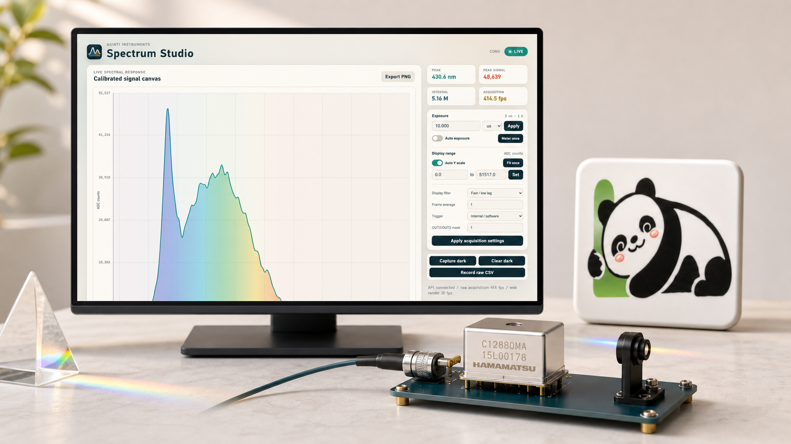

# AgInTi Spectrometer

[English](../README.md) · [العربية](README.ar.md) · [Español](README.es.md) · [Français](README.fr.md) · [日本語](README.ja.md) · [한국어](README.ko.md) · [Tiếng Việt](README.vi.md) · [中文 (简体)](README.zh-Hans.md) · [中文（繁體）](README.zh-Hant.md) · [Deutsch](README.de.md) · [Русский](README.ru.md)



AgInTi Spectrometer هو بيئة سريعة لالتقاط وعرض بيانات C12880MA. يزوّد محرك قياس واحد تطبيق Qt ولوحة الويب وتسجيل CSV وواجهة الأوامر وواجهة REST، مع فصل القراءة التسلسلية عن الرسم للحفاظ على الدقة الزمنية.

## المزايا

- طيف معاير بين 340 و850 نانومتر.
- تعريض ثابت أو تكيفي أو قياس لمرة واحدة ابتداءً من الميكروثانية.
- معدلات مستقلة للالتقاط وتحديث العرض.
- طرح الإطار المظلم والمتوسط والترشيح والتحجيم التلقائي وتصدير CSV الخام.
- واجهات سطح مكتب وويب وAPI مناسبة للوكلاء.

## البدء السريع

```powershell
python -m venv .venv
.\.venv\Scripts\python.exe -m pip install -e .
.\.venv\Scripts\spectrum-studio.exe
```

صِل الجهاز، واختر منفذ COM، ثم ابدأ الالتقاط. مرشحات العرض لا تغيّر العينات الخام المسجلة.

## الدعم

[LazyingArt](https://chat.lazying.art/donate) · [PayPal](https://paypal.me/RongzhouChen) · [Stripe](https://buy.stripe.com/aFadR8gIaflgfQV6T4fw400)
